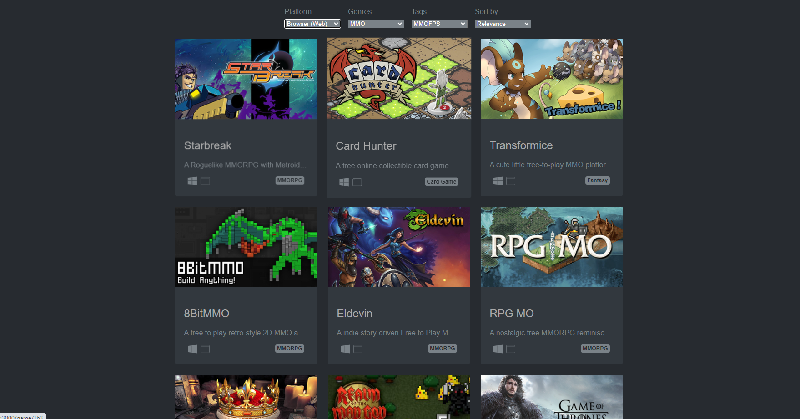
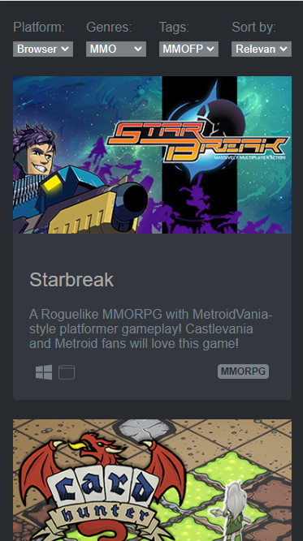

# Game Website

This project Basic Setup for React application without CRA,


## Table of contents

- [Overview](#overview)
  - [Screenshot](#screenshot)
- [My process](#my-process)
  - [Built with](#built-with)
  - [Continued development](#continued-development)
  - [dependencies](#dependencies)
  - [devDependencies](#devdependencies)

## Overview
### Screenshot





## My process
### Built with

- Semantic HTML5 markup
- CSS custom properties
- Flexbox
- react-router-dom
- axios
- typescript
- eslint
- Styled Components

### Useful resources

- [freetogame Api](https://www.freetogame.com/api-doc) - I use this api to fetch games data


### Continued development

- [ ] Add query pramas with router
- [ ] Game Detail
- [ ] Filter by tags multiple
- [ ] Styling Fetch error message & return button


### dependencies
``` bash
yarn add react react-dom react-router-dom styled-components @babel/polyfill axios core-js
```

### devDependencies

```bash
yarn add @babel/core @babel/preset-env @babel/preset-react @babel/preset-typescript @types/axios @types/react @types/react-dom @types/react-router-dom @types/styled-components @typescript-eslint/eslint-plugin @typescript-eslint/parser babel-loader babel-plugin-styled-components eslint eslint-config-prettier eslint-plugin-react eslint-plugin-react-hooks html-webpack-plugin husky lint-staged prettier stylelint stylelint-config-recommended stylelint-config-styled-components stylelint-custom-processor-loader stylelint-processor-styled-components typescript webpack webpack-cli webpack-dev-server
```
